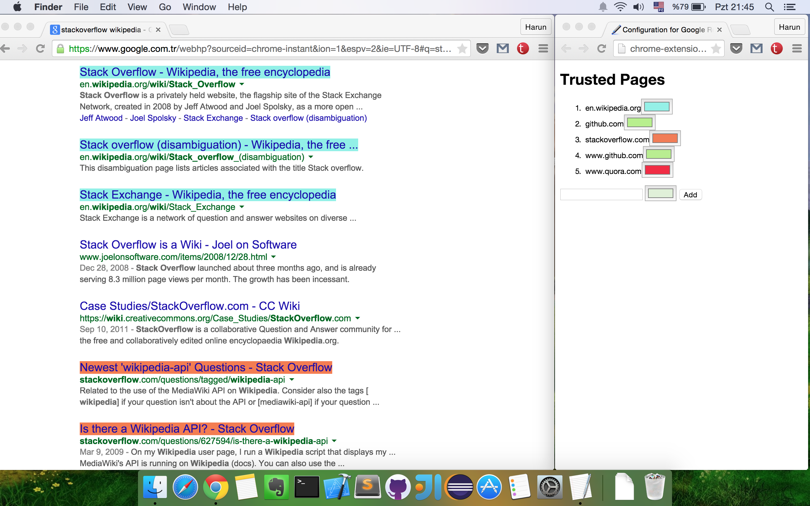

# Google Result Highlighter

This is a chrome extension to highlight google search results from trusted sources. User can add trusted hostnames/webpages in extension's options page. And if google search results are from these webpages, their link highlighted to help user to find what's wanted easily.

## Install and Configuration

Not yet released on Chrome Web Store. But if you want, you can install as unpacked extension. However I don't recommend because still in development and has some bugs which I will fix after my finals.

1. Download zip or clone in desktop
2. Open `chrome://extensions/` on browser
3. Click `Load unpacked extension...` and select the project folder.

To configure your trusted sources, 

1. Open `chrome://extensions/` on browser
2. Find the extension and click `Options` 
3. Enter hostname (ex: stackoverflow.com) and select highlight color
4. Click `Add` and you are done.

Note: Not all of google country domains added to manifes.json. Thus if your google domain is not there, you need to add it manually to file.

## ScreenShots

